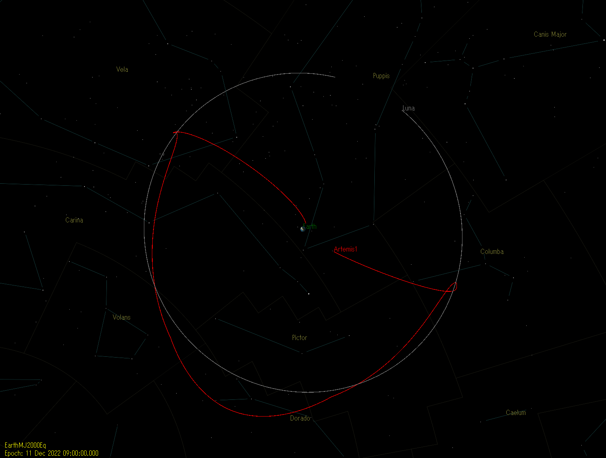
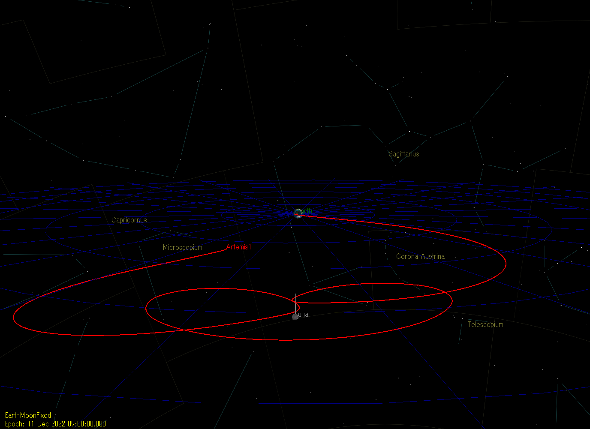
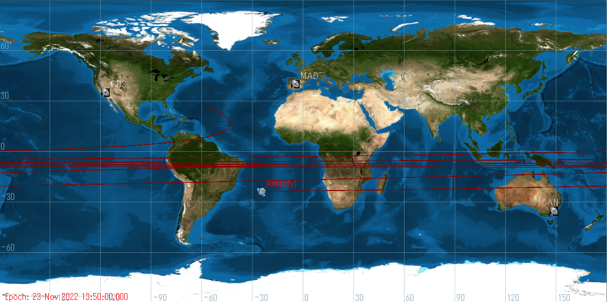
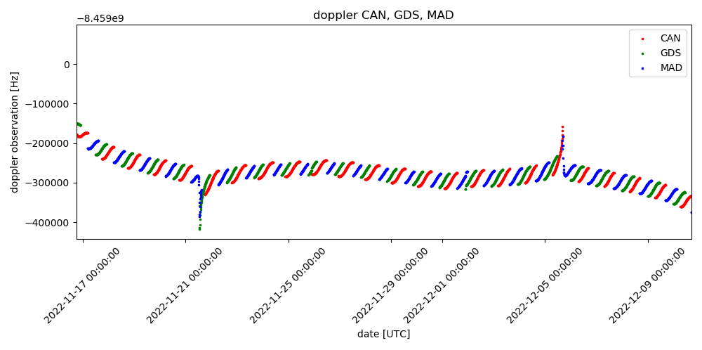

# Artemis1
Artemis1 simulation using GMAT

### inertial frame

### Earth Moon frame

### ground trace

### doppler observation

### orbit determination
coming soon

## Requirement
* GMAT R2020a
* matplotlib
* astropy

## Note
The following trajectory data was used.

https://www.nasa.gov/feature/track-nasa-s-artemis-i-mission-in-real-time/